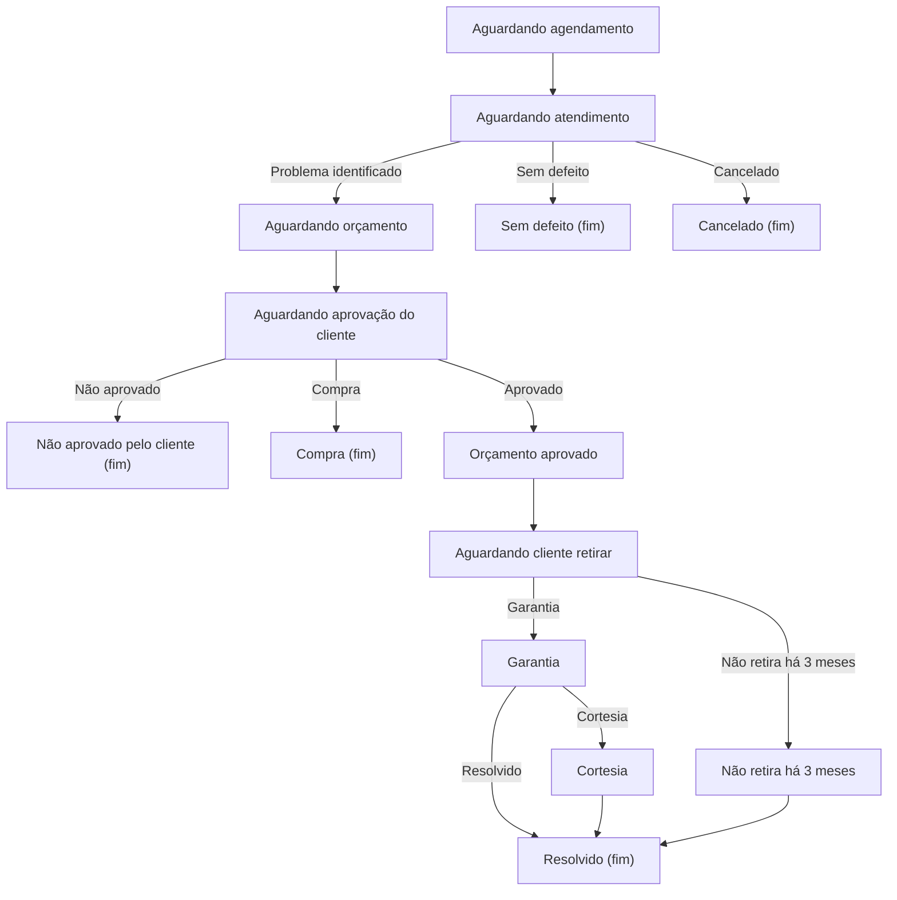

<div style="display: flex; justify-content: center; align-items: center; flex-direction: column;">
    <br>
    
    <hr/>
    <p>
      
    </p>
    <p style="text-align: center">
        An API using <a href="https://spring.io/projects/spring-boot">Spring Boot</a> 
        with the consuming in a <a href="https://flutter.dev">Flutter</a> application utilizing MySql as the database 
        de dados.
    </p>
</div>

## ServOeste API

Backend API for managing a services workshop (`assistência técnica`) domain, built with **Spring Boot**, **Clean Architecture**, and **domain‑driven design (DDD)**.  
It powers a Flutter client and persists data in **MySQL**.

---

## 🚀 Project Purpose

The API models the full lifecycle of service orders for a technical assistance shop, including:

- **Clients, technicians and specialties**
- **Service orders** and their status transitions (e.g. scheduling, diagnosis, quotation, approval, execution, warranty)
- **Authentication and authorization** with JWT
- **Search and filtering** over technicians, clients and services

The main goal is to provide a **clean, testable and observable** backend suitable both for production and as a portfolio reference for Clean Architecture with Spring Boot.

---

## 🏗️ Architecture Overview

The project follows a Clean Architecture / DDD style with clear separation between **presentation**, **application**, **domain** and **infrastructure**:

| Layer              | Package prefix                    | Responsibility                                                                 |
|--------------------|-----------------------------------|--------------------------------------------------------------------------------|
| **Presentation**   | `com.serv.oeste.presentation..`   | REST controllers and Swagger docs (`*Controller`, `*Swagger`)                  |
| **Application**    | `com.serv.oeste.application..`    | Use cases / services, DTOs, application contracts (ports)                      |
| **Domain**         | `com.serv.oeste.domain..`         | Entities, value objects, enums, domain exceptions, domain repositories (ports) |
| **Infrastructure** | `com.serv.oeste.infrastructure..` | JPA entities, Spring Data repositories, security, configuration, integrations  |

Architecture rules are enforced by **ArchUnit** (`CleanArchitectureTest`) to ensure:

- Presentation and infrastructure do not become dependencies of other layers
- Domain layer does not depend on Spring or external frameworks
- Controllers do not access domain entities directly, but go through application services/DTOs



```text
   ┌────────────────┐       ┌────────────────┐        ┌───────────────┐
   │  FrontEnd App  │──────▶│   /auth/login  │───────▶│  AuthService  │
   └──────┬─────────┘       └────────────────┘        └───────┬───────┘
          │                         │                         │
          │<─────── accessToken + refreshToken (cookie) ──────┘
          │
   Access token expires
          │
          ├───▶ Sends request with expired token
          │         │
          │         ├──401 Unauthorized
          │         │
          ├──▶ TokenRefreshInterceptor intercepts
          │         │
          ├──▶ Calls /auth/refresh using cookie
          │         │
          ├──▶ Receives new access token
          │         │
          └──▶ Retries the original failed request transparently
```

---

## 📁 Project Structure

Key packages:

- **`com.serv.oeste.presentation`**: REST controllers for auth, users, technicians, services, addresses and clients, plus Swagger/OpenAPI configuration.
- **`com.serv.oeste.application`**: Application services (e.g. `ServiceService`, `TechnicianService`, `ClientService`, `AuthService`), request/response DTOs, and security/application contracts.
- **`com.serv.oeste.domain`**: Core model (`User`, `Client`, `Technician`, `Service`, value objects like `Phone`, filters and paging types), domain exceptions and repository interfaces.
- **`com.serv.oeste.infrastructure`**: Spring configuration (security, cache, clock, clients), persistence adapters (JPA repositories and entities), JWT implementation, refresh token storage, specifications and middleware (filters, exception handling, observability).
- **`src/main/resources`**: `application.yml`, `logback-spring.xml` and Flyway migrations.
- **`src/test/java`**: Unit tests for domain entities and application services, plus architecture tests (`CleanArchitectureTest`).

---

## 🔑 Key Technologies

- **Language & Framework**
  - Java 21
  - Spring Boot 4.x
  - Spring Web, Spring Data JPA, Flyway
- **Security**
  - Spring Security
  - JWT with `jjwt` (`jjwt-api`, `jjwt-impl`, `jjwt-jackson`)
- **API & Docs**
  - Springdoc OpenAPI (`springdoc-openapi-starter-webmvc-ui`)
  - Swagger UI exposed at `/swagger`
- **Database**
  - MySQL (runtime)
  - H2 (tests)
- **Testing**
  - JUnit, Spring Boot Test
  - ArchUnit for architecture rules
- **Observability**
  - `spring-boot-starter-opentelemetry`
  - OTLP exporters configured via `application.yml`
  - `opentelemetry-logback-appender-1.0` for log correlation

---

## 🔒 Security Overview

The security model is based on **JWT**:

- Login issues an **access token** and a **refresh token**.
- Tokens are validated in the **infrastructure** layer (`JwtTokenService`, `JwtAuthFilter`) implementing application contracts.
- Roles and permissions are represented in the domain (`Roles`) and enforced via Spring Security configuration.
- Refresh tokens are persisted and managed through `RefreshTokenService` and related repositories.

All security‑related logic is encapsulated behind interfaces in the **application layer** to keep the domain independent of JWT and Spring Security details.

---

## 👁️ Observability (OpenTelemetry, Tracing, Logging, Metrics)

Observability is implemented using **OpenTelemetry** and Spring Boot Actuator / Micrometer:

- **Tracing**
  - Enabled via `spring-boot-starter-opentelemetry`.
  - OTLP exporters configured in `application.yml` under the `management` section:
    - Traces: `${OTEL_ENDPOINT}/v1/traces`
    - Metrics: `${OTEL_ENDPOINT}/v1/metrics`
    - Logs: `${OTEL_ENDPOINT}/v1/logs`
  - `TraceResponseFilter` adds `trace-id` and `traceparent` headers to every HTTP response so that frontend or external tools can correlate requests with traces.

- **Logging**
  - `logback-spring.xml` configures the standard console appender and the OpenTelemetry appender (`OTEL`).
  - `OpenTelemetryAppenderConfiguration` installs the Logback appender programmatically with the `OpenTelemetry` SDK instance.
  - Application services (e.g. `ServiceService`, `TechnicianService`, `ClientService`) use **structured logging** with SLF4J placeholders: `logger.info("Service found: id={}", id);`.

- **Metrics**
  - Metrics are exported via OTLP using the same `${OTEL_ENDPOINT}`.
  - Spring Boot and Micrometer provide default JVM and HTTP metrics that can be scraped/collected by the configured backend (e.g. Aspire dashboard).

With `docker-compose.yaml`, an **Aspire dashboard** is provided for local exploration of traces, logs and metrics.

---

## 🧪 Testing Strategy

The project adopts a layered testing strategy:

- **Unit tests (domain & application)**
  - Located under `src/test/java/com/serv/oeste/domain` and `src/test/java/com/serv/oeste/application`.
  - Cover domain entities (e.g. `ServiceTest`, `TechnicianTest`, `ClientTest`) and application services (`ServiceServiceTest`, `TechnicianServiceTest`, `ClientServiceTest`).

- **Architecture tests**
  - `CleanArchitectureTest` (ArchUnit) enforces Clean Architecture rules:
    - Domain does not depend on frameworks.
    - Controllers do not access domain entities directly.
    - Layers follow the allowed dependency directions.

- **Application bootstrap tests**
  - `ServOesteApplicationTests` validates that the Spring context starts correctly.

Run the whole test suite with:

```bash
./mvnw test
```

---

## ⚙️ Environment & Configuration

Core configuration is in `application.yml`. Environment variables (see `.env.example`) control database, security and observability:

| Key                             | Description                                  |
|---------------------------------|----------------------------------------------|
| `MYSQL_USERNAME`                | MySQL username                               |
| `MYSQL_PASSWORD`                | MySQL password                               |
| `DB_HOST`                       | Database host                                |
| `DB_PORT`                       | Database port                                |
| `DB_NAME`                       | Database name                                |
| `JWT_TOKEN_SECRET`              | Secret key for signing JWTs                  |
| `JWT_TOKEN_EXPIRATION_TIME`     | Access token lifetime in ms                  |
| `REFRESH_TOKEN_EXPIRATION_TIME` | Refresh token lifetime in ms                 |
| `APP_ADMIN_USERNAME`            | Initial admin username                       |
| `APP_ADMIN_PASSWORD`            | Initial admin password                       |
| `OTEL_ENDPOINT`                 | Base URL for OTLP traces/logs/metrics export |

Copy `.env.example` to `.env` and adjust values for your environment.

---

## 🧩 How to Run Locally

### Prerequisites

- Java 21
- Maven (or use the included `mvnw` wrapper)
- Docker + Docker Compose (optional, for running MySQL and observability stack)

### Option 1: Run with local MySQL

1. Configure a local MySQL instance and create the target database.
2. Set the environment variables (e.g. via `.env` or your shell).
3. Run the application:

```bash
./mvnw spring-boot:run
```

The API will be available at `http://localhost:8080/api`.

### Option 2: Run with Docker Compose (API + MySQL + Aspire)

1. Copy `.env.example` to `.env` and fill the required values.
2. Start the stack:

```bash
docker compose up --build
```

This will start:

- `serv-oeste-mysql` (MySQL database)
- `serv-oeste-server` (Spring Boot app)
- `aspire-dashboard` (observability UI; OTEL endpoints exposed at `http://localhost:4318`)

---

## 📘 API Documentation & Example Requests

Once the application is running, the Swagger UI is available at:

- `http://localhost:8080/swagger`

From there you can explore and execute example requests for:

- **Authentication**: login, token refresh, etc.
- **Users**: CRUD operations on system users.
- **Technicians & Specialties**: manage technicians and their specialties.
- **Clients**: manage clients.
- **Services**: create, update, list and filter service orders.

All endpoints are served under the `/api` context path (see `server.servlet.context-path`).

---

## 💡 Design & Code Quality Notes

- **Clean Architecture & DDD**
  - Application services orchestrate use cases; the domain layer contains business rules and invariants.
  - Repository interfaces live in the domain/application layers; JPA implementations are in `infrastructure.repositories`.
  - Architecture tests prevent accidental violations as the codebase evolves.

- **Global exception handling**
  - `GlobalExceptionHandler` maps domain and validation errors to **RFC 7807 ProblemDetails** responses, using `ProblemDetailsUtils` for consistent payloads.

- **Logging & Observability**
  - SLF4J is used consistently in services for structured logs.
  - OpenTelemetry integration ensures traces, metrics and logs can be correlated via `trace-id` and `traceparent` headers.

---

## 👤 Author

**Lucas Bonato**  
Software Engineer & Flutter Developer  
📧 [lucas.perez.bonato@gmail.com](mailto:lucas.perez.bonato@gmail.com)